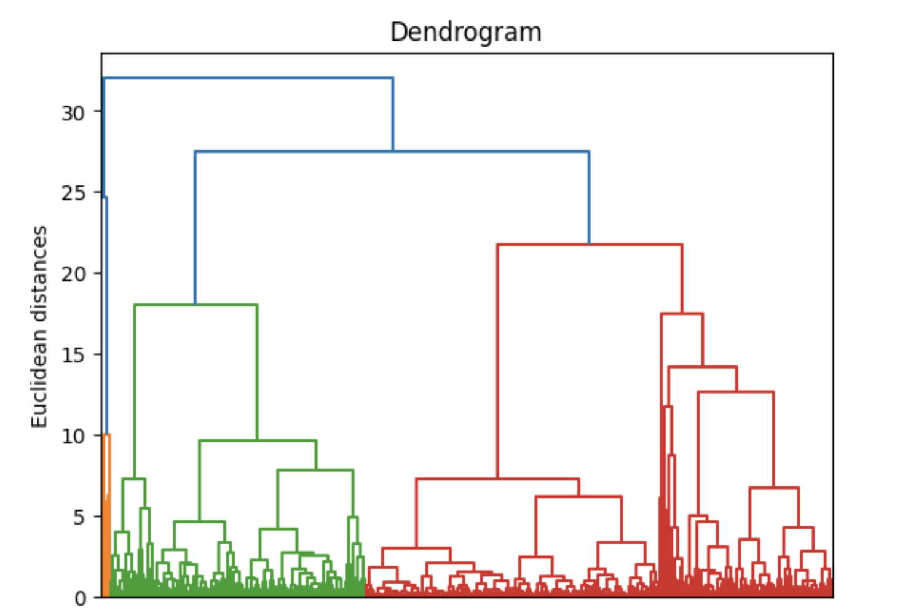

# Wholesale Customer Data Analysis 📊

Utilize unsupervised learning techniques to construct multiple learning models using a wholesale dataset, discerning customer groupings based on expenditure across various product categories (e.g., Grocery, Milk, Detergent_Products, Fresh food, Frozen food, Deli). This aims to enhance skills in:

- Exploratory data analysis and pre-processing 🔍
- KMeans and hierarchical clustering 📈
- Principal Component Analysis (PCA) 🧬

  


## Project Phases 🚀

1. **Exploratory Data Analysis:** Utilize Pandas and Python methods for data analysis.
2. **Data Preprocessing:** Engineer features and address missing values and outliers.
3. **Model Training:** Employ KMeans, Hierarchical Clustering, and PCA.
4. **Model Evaluation:** Compare model performance with scaled and non-scaled data.
5. **Created a Streamlit app.** 

## Project Scope 🌐

This project applies unsupervised learning to real-world wholesale data, visualizing insights derived from the analysis. Tasks include:

- **Exploratory Data Analysis:** Clean data, analyze relationships, and perform feature engineering.
- **Unsupervised Learning:** Apply k-means and hierarchical clustering, and PCA to identify patterns and group similar data points.
- **Insight Communication:** Communicate findings using visualizations and metrics for informed decision-making.

## Key Findings 🔑

- KMeans and Hierarchical Clustering revealed three distinct customer segments based on expenditure across product categories.
- PCA analysis demonstrated that 86% variance can be explained by two principal components (PC1 and PC2), and 93% with three components (PC1, PC2, PC3). Opting for two components balances variance coverage and simplifies analyses.
- Scaled data didn't provide clearer insights in clustering. Unscaled data resulted in more interpretable Elbow Plots and cleaner model outcomes.

## Reflection and Next Steps 🤔

This project highlighted areas for further exploration:

- Exploring scaling techniques to improve convergence without distorting model outcomes.
- Assessing the tradeoff between dimensionality reduction and capturing variance.
- Investigating alternative visualization methods for clustering without relying on specific code.

## Pending Questions ❓

1. Does retaining three dimensions significantly impact downstream applications compared to the gained 7% variance?
2. How can this tradeoff between dimensionality and variance retention be quantified?

## Learning Goals 🎓

Further understanding sought in exploring scaling methods, evaluating dimensionality, and discovering alternative visualization approaches for clustering.


### Some Code Snippets 📜


#### Elbow Method for Optimal Clusters

```python
# Function for plotting distortion in Elbow Rule

def plot_distortion(X, max_clusters=10):
    # Code for finding distortion values for different clusters
    # Plotting distortion against number of clusters
    plt.plot(range(1, max_clusters + 1), distortions, marker='o')
    plt.xlabel('Number of clusters')
    plt.ylabel('Distortion')
    plt.title('Elbow Method for Optimal Clusters')
    plt.show()
```
#### The Dendrogram:



